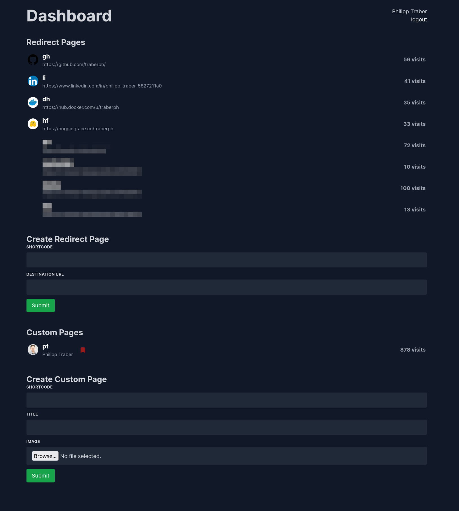
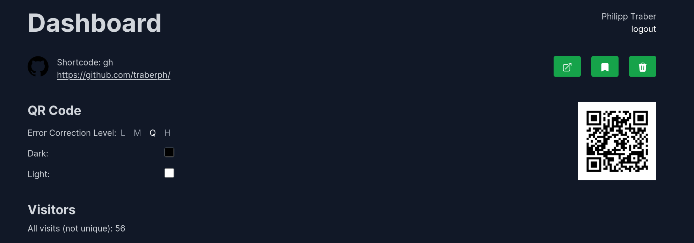
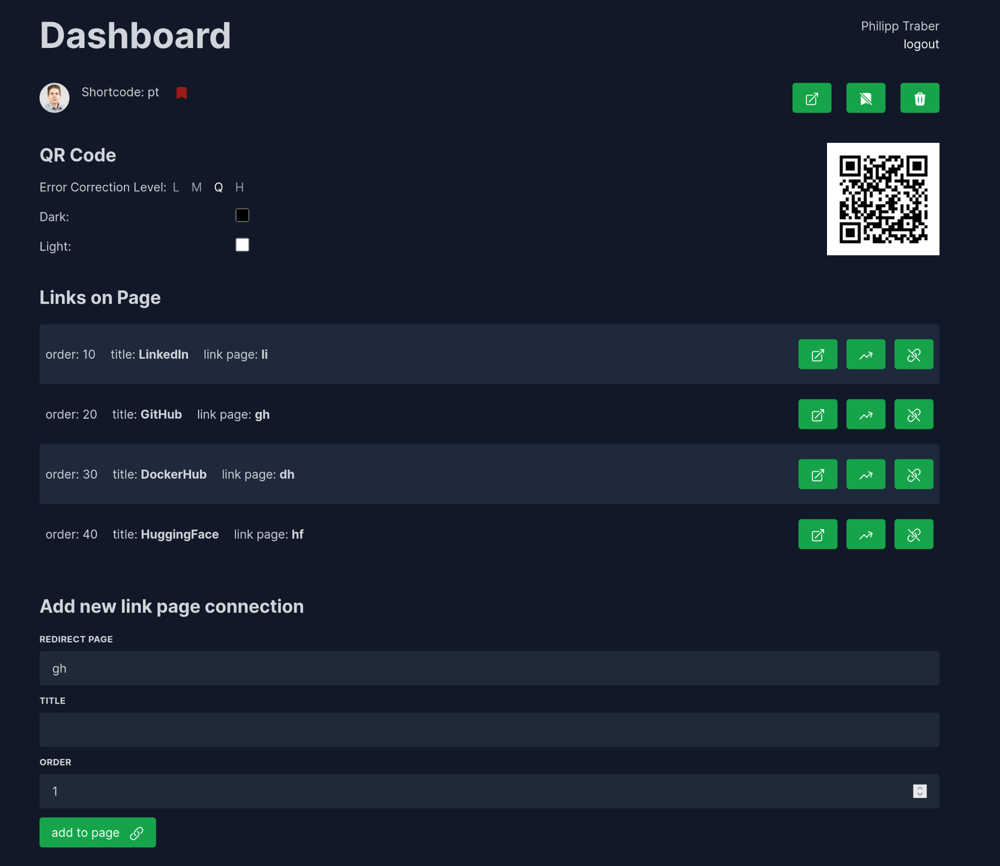

# Short

This tool is intended to provide simple url shorting and link aggregation functionality.
Users should be able to create short links for example to generate smaller QR codes with the builtin QR code generator.

The admin panel is a PWA for easy access and management of the links even on mobile devices.

It is powered by nextjs and postgres.  
Authentication is outsourced via OAuth2.

# Example Page
- optimized for mobile view
- simple and clean design

# Easy to use Admin Interface

## Overview Page

- get an overview of all links and their views

## Redirect Pages

- a simple redirect to a target url

# Custom Pages

- an aggregation of multiple redirect pages
- (future work - text blocks; image blocks)

